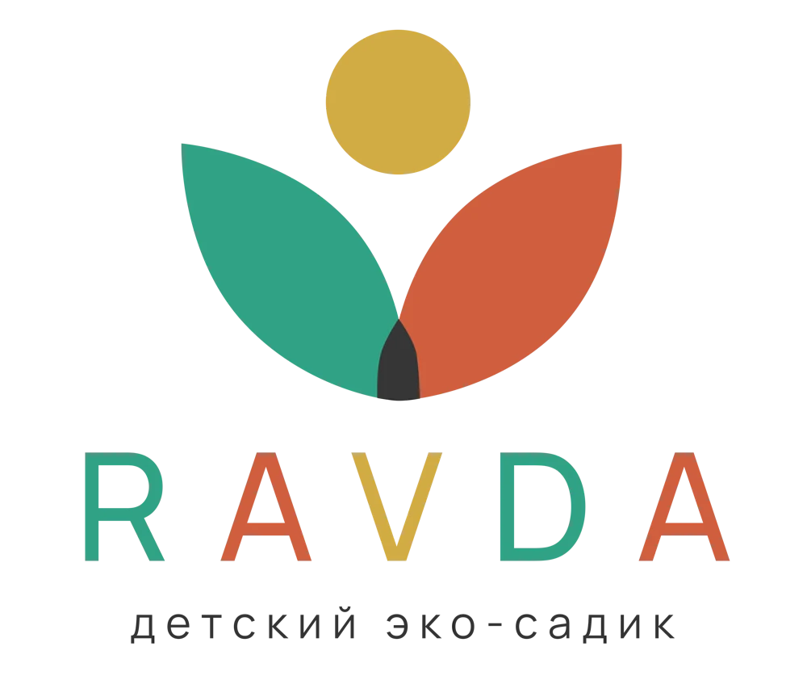

<div align="center">



# 🌿 RAVDA
### Большой мир. Маленькие шаги. Счастливое детство.

**Детский эко-садик в Буйнакске · Сайт-визитка**

[](https://veanat17.github.io/ravda/)
[](https://wa.me/79286755408)
[](https://www.instagram.com/ravda.centers/)

*Детям хорошо, а мамам спокойно.*

</div>

---

## 💛 О проекте

RAVDA — детский эко-садик, где знакомство с большим миром начинается с заботы, игры и маленьких самостоятельных шагов. Здесь важны доброта, уважение к семье и окружающим, любознательность и интерес к природе.

Этот репозиторий содержит сайт-визитку сада: фотографии, видео, сведения о занятиях, публикации, отзывы и способы связаться с администратором. Его задача — помочь родителям почувствовать атмосферу RAVDA, найти ответы на первые вопросы и договориться о знакомстве.

> 🌱 **Главная услуга:** забота о детях дошкольного возраста и их развитие в небольших группах — через игру, творчество, языки, подготовку к школе и знакомство с природой.

**Адрес сайта:** [veanat17.github.io/ravda](https://veanat17.github.io/ravda/)  
**Репозиторий:** [github.com/veanat17/ravda](https://github.com/veanat17/ravda)

README — описание проекта и инструкция для человека, который его поддерживает. Главная страница самого сайта находится в **`index.html`**. Изменение README не меняет тексты на сайте.

## 🧭 Навигация

- [Что предлагает RAVDA](#-что-предлагает-ravda)
- [Особенности сайта](#-особенности-сайта)
- [Контакты](#-контакты)
- [Файлы проекта](#-файлы-проекта)
- [Публикация на GitHub Pages](#-публикация-на-github-pages)
- [Как обновлять сайт](#-как-обновлять-сайт)
- [Как изменить этот README](#-как-изменить-этот-readme)
- [Проверка после обновления](#-проверка-после-обновления)
- [Если что-то не работает](#-если-что-то-не-работает)
- [Технические сведения](#-технические-сведения)
- [Материалы и права](#-материалы-и-права)

---

## 🌼 Что предлагает RAVDA

| Направление | Что важно для семьи |
|---|---|
| 🤲 Забота и общение | Тёплая атмосфера, внимание к ребёнку и контакт с родителями |
| 🌱 Небольшие группы | По представленным публикациям — до 15 детей, в младшей группе до 10 |
| 🗣️ Английский и арабский | Знакомство с языками и развитие интереса к новым словам |
| 📚 Подготовка к школе | Занятия для следующего этапа взросления |
| 🎨 Творчество | Возможность пробовать, придумывать и выражать себя |
| 🧩 Самостоятельность | Маленькие повседневные открытия: «Я могу сам!» |
| 🌳 Прогулки и природа | Исследование окружающего мира и совместные приключения |
| 🥗 Полезное питание | Внимание к питанию; меню и индивидуальные вопросы обсуждаются с администрацией |
| 💚 Семейные ценности | Знакомство с исламскими ценностями в понятной и бережной форме |

**Возраст, наличие мест, режим работы, стоимость и состав программы уточняются у администратора.** Сведения из публикаций не заменяют актуальные условия приёма. В материалах встречались разные нижние возрастные границы, поэтому подходящую группу важно обсудить лично.

## ✨ Особенности сайта

### 🌿 Объёмный персонаж-проводник

Фирменный росток RAVDA встречает посетителя на первом экране. Персонаж создан средствами Three.js: реагирует на указатель, двигается и приветствует по нажатию. Есть кнопки «Помаши мне», «Расскажи о садике» и «Включить голос».

Голос использует синтез речи браузера и заранее написанные реплики. Это **не чат-бот и не диалог с искусственным интеллектом**. Наличие и звучание русского голоса зависят от устройства и браузера. При недоступности 3D предусмотрена статичная иллюстрация.

### 🎬 Видео внутри страницы

Ролик «О нас за 40 секунд» встроен в главный экран. На компьютере предусмотрен запуск при наведении, на сенсорном устройстве — взаимодействие нажатием. Звук включается отдельно. Доступны собственные кнопки воспроизведения и шкала времени.

В галерее можно открыть видео о жизни сада и увеличить фотографии. Исходные медиа размещены в папке `assets`.

### 🍃 Детали, которые создают настроение

- Фирменные иллюстрации, природная палитра и декоративные элементы.
- Анимации появления блоков и персонажа.
- Подсказки маленького проводника при просмотре страницы.
- Переключаемые направления занятий.
- Раскрывающиеся ответы на частые вопросы.
- Кнопка остановки анимации и учёт настройки уменьшения движения.
- Адаптивная вёрстка и мобильное меню.

### 📍 Понятный путь к знакомству

Родитель может изучить подход сада, посмотреть материалы и перейти к связи с администратором. Кнопки записи ведут в WhatsApp; самостоятельной системы бронирования и базы заявок в проекте нет.

---

## 📞 Контакты

| Канал | Контакт |
|---|---|
| **Администратор** | **8 928 675 54 08** |
| Международный формат | **+7 928 675 54 08** |
| WhatsApp | [Написать администратору](https://wa.me/79286755408) |
| MAX | Связь по номеру **+7 928 675 54 08**, возможность поиска зависит от настроек аккаунта и приложения |
| Instagram | [@ravda.centers](https://www.instagram.com/ravda.centers/) |
| Адрес | **Буйнакск, ул. Хизроева, 57А** |
| Карта | [Посмотреть адрес в Яндекс Картах](https://yandex.ru/maps/?text=Буйнакск%20Хизроева%2057А) |

**Как работает кнопка MAX:** сайт открывает окно с номером, возможностью его скопировать и ссылкой на веб-версию MAX. Это не прямая ссылка на подтверждённый чат администратора.

## 🗂️ Файлы проекта

После загрузки готового сайта файлы должны лежать непосредственно в корне репозитория:

| Файл или папка | Назначение | Когда редактировать |
|---|---|---|
| `index.html` | Главная страница, разделы, контакты, ссылки, метаданные | Изменить текст, телефон, адрес, изображения |
| `style.css` | Основная вёрстка, цвета и адаптивное оформление | Изменить внешний вид |
| `app.js` | Меню, вкладки, модальные окна, копирование номера и другие действия | Изменить поведение интерфейса |
| `garden.css` | Дополнительные стили фирменного оформления | Настроить оформление персонажа и связанных элементов |
| `garden.js` | Реплики проводника, голос, встроенное видео и дополнительные взаимодействия | Обновить сценарии и реплики |
| `character.js` | 3D-сцена и движения персонажа | Изменить модель, материалы, освещение и жесты |
| `assets/` | Фото, видео, QR-код и локальные зависимости | Обновить материалы |
| `assets/brand/` | Логотип, персонаж и декоративные иллюстрации | Обновить фирменные изображения |
| `assets/three.module.js` | Локальная библиотека Three.js | Только при осознанном обновлении зависимости |
| `.nojekyll` | Служебный файл для публикации готовой статики | Создать один раз и оставить |
| `README.md` | Этот документ | Обновить описание и инструкцию |

> **Важно:** `index.html` должен находиться рядом с `README.md`, а не внутри дополнительной папки `RAVDA-Netlify`. ZIP-архив сам по себе сайтом не становится — его сначала распаковывают.

## 🚀 Публикация на GitHub Pages

### Первая загрузка

1. Распакуйте архив готового сайта на компьютере.
2. Откройте репозиторий `veanat17/ravda`, вкладку **Code**.
3. Нажмите **Add file → Upload files**.
4. Перетащите содержимое распакованной папки: HTML, CSS, JavaScript и всю папку `assets`.
5. Дождитесь окончания загрузки.
6. Напишите понятное описание, например `Загрузка сайта RAVDA`.
7. Выберите сохранение в `main` и нажмите **Commit changes**.
8. Если `.nojekyll` отсутствует, создайте его через **Add file → Create new file**. Имя начинается с точки, содержимое можно оставить пустым.

### Настройки публикации

Откройте **Settings → Pages** внутри репозитория:

| Настройка | Значение |
|---|---|
| Source | `Deploy from a branch` |
| Branch | `main` |
| Folder | `/(root)` |
| Custom domain | Оставить пустым при использовании стандартного адреса |

Нажмите **Save**, затем посмотрите результат во вкладке **Actions**. Зелёная галочка у последнего процесса публикации означает успешное завершение. На странице **Settings → Pages** появится ссылка **Visit site**.

Адрес: **https://veanat17.github.io/ravda/**

Поле **Custom domain** предназначено для собственного домена, которым вы управляете. Просто вписать `ravda` или придуманный адрес недостаточно: для собственного домена требуется отдельная регистрация и настройка DNS.

Публикация не означает мгновенного появления в Google или Яндексе. Индексация поисковиками — отдельный процесс. Доступность без VPN проверяется на реальных сетях посетителей; одна успешная проверка не гарантирует доступность у всех операторов.

## 🛠️ Как обновлять сайт

### Изменить текст

1. Во вкладке **Code** откройте `index.html`.
2. Нажмите значок карандаша — **Edit this file**.
3. Найдите нужную фразу и измените текст, сохраняя окружающие HTML-теги.
4. Нажмите **Commit changes…**, укажите суть правки и подтвердите сохранение в `main`.
5. Дождитесь публикации и проверьте результат на сайте.

Часть текстов находится в JavaScript: содержимое переключаемых блоков ищите в `app.js`, реплики персонажа — в `garden.js`. README редактируется отдельно и не синхронизирует данные с сайтом автоматически.

### Изменить телефон

Номер встречается в нескольких форматах и нескольких местах:

| Где используется | Текущее значение |
|---|---|
| Видимый текст | `8 928 675 54 08` |
| Международное написание | `+7 928 675 54 08` |
| Ссылка для звонка | `tel:+79286755408` |
| Ссылка WhatsApp | `https://wa.me/79286755408` |
| Копирование в MAX | `+79286755408` |

Проверьте **`index.html` и `app.js`**, затем обновите раздел контактов в README. В `index.html` обратите внимание не только на видимый текст, но и на `meta name="description"` в начале файла — это описание страницы для поисковиков.

У ссылок WhatsApp может быть продолжение `?text=...`: это заранее подготовленный текст сообщения. При смене номера его можно сохранить.

### Заменить фотографию или видео

Самый простой способ — загрузить новый файл **с тем же именем и расширением в ту же папку**. Тогда ссылки в коде менять не потребуется.

Если меняется имя, обновите и соответствующие пути в HTML, CSS или JavaScript. Регистр имеет значение: `Photo.jpg` и `photo.jpg` — разные имена.

Для новой фотографии заполните осмысленный `alt`, например «Дети на прогулке с воспитателем». Не используйте слишком тяжёлые оригиналы там, где достаточно уменьшенного изображения.

Для ролика с новым содержанием или длительностью проверьте подписи, обложку и начальное значение продолжительности в интерфейсе. Не оставляйте «40 секунд», если новый ролик существенно длиннее.

### Обновить сразу несколько файлов

Используйте **Add file → Upload files**, загрузите изменённые файлы в соответствующие папки и сохраните одним коммитом. Файлы с совпадающими путями заменятся. Файлы, которые не были загружены, останутся на месте.

### Вернуть прежний вариант

Если ошибка возникла после правки одного файла:

1. Откройте файл в репозитории и его историю — **History**.
2. Найдите версию до неудачного изменения и откройте её содержимое.
3. Скопируйте прежний текст.
4. Вернитесь к текущему файлу в `main`, нажмите карандаш и вставьте прежнее содержимое.
5. Сохраните новым коммитом с описанием восстановления.

Не удаляйте весь репозиторий ради исправления одного файла. Перед большим обновлением полезно сохранить копию проекта через **Code → Download ZIP**.

## 📝 Как изменить этот README

### Добавить готовый файл или заменить существующий

1. Откройте главную страницу репозитория, вкладку **Code**.
2. Нажмите **Add file → Upload files**.
3. Перетащите подготовленный файл **`README.md`**.
4. В описании напишите `Обновление описания проекта`.
5. Нажмите **Commit changes**.

Если файл с таким именем уже есть в корне, загрузка заменит его содержимое. Если браузер назвал скачанный файл `README (1).md`, сначала переименуйте его в `README.md`.

### Редактировать прямо на GitHub

Откройте `README.md` → нажмите карандаш → измените текст → переключитесь на **Preview** для просмотра оформления → сохраните через **Commit changes**.

### Шпаргалка по Markdown

| Что нужно | Как написать |
|---|---|
| Крупный заголовок | `# Заголовок` |
| Раздел | `## Название раздела` |
| Жирный текст | `**Важная мысль**` |
| Курсив | `*Выделение*` |
| Ссылка | `[Открыть сайт](https://veanat17.github.io/ravda/)` |
| Пункт списка | `- Один пункт` |
| Заметка | `> Текст заметки` |
| Картинка | `` |

Логотип наверху загружается из `assets/brand/logo-3.webp`. Он появится, когда эта папка будет в репозитории. Цветные значки загружаются с Shields.io; если внешний сервис недоступен, обычные текстовые ссылки и содержание документа сохраняют свою полезность.

## ✅ Проверка после обновления

- [ ] Последняя публикация во вкладке **Actions** завершилась успешно.
- [ ] Вместо тестовой страницы открывается полноценный сайт.
- [ ] Фотографии и логотип загружаются.
- [ ] Видео запускается, звук включается по желанию пользователя.
- [ ] Персонаж или его резервная иллюстрация отображается.
- [ ] Меню работает на телефоне.
- [ ] WhatsApp открывает нужный номер.
- [ ] Кнопка звонка содержит правильный номер.
- [ ] MAX копирует правильный номер.
- [ ] Адрес и ссылка на карту соответствуют данным сада.
- [ ] Стоимость и условия подтверждены администратором.
- [ ] Проверена страница без VPN на Wi-Fi и мобильном интернете.

## 🧯 Если что-то не работает

| Что видно | Что проверить |
|---|---|
| Старая тестовая надпись | Заменился ли `index.html` и завершилась ли последняя публикация; затем нажать `Ctrl + F5` |
| Ошибка 404 | Правильность URL, наличие `index.html` в корне и настройки `main / (root)` |
| Текст есть, оформления нет | Загружены ли CSS-файлы, совпадают ли пути к ним |
| Нет фотографий | Содержимое `assets`, имена файлов и регистр букв |
| Нет 3D-персонажа | Загрузку `character.js`, `assets/three.module.js` и поддержку WebGL устройством |
| Персонаж не говорит | Кнопку включения голоса, громкость и доступность русского синтеза речи |
| Видео без звука | Это исходный режим; звук включается отдельной кнопкой |
| Красная ошибка Custom domain | Оставить поле пустым для стандартного адреса GitHub Pages |
| Красный значок во вкладке Actions | Открыть последнюю неудачную публикацию и прочитать конкретную ошибку |
| Файл README отображается без логотипа | Проверить наличие `assets/brand/logo-3.webp` по указанному пути |

## ⚙️ Технические сведения

| Компонент | Реализация |
|---|---|
| Страницы | HTML |
| Оформление | CSS |
| Поведение | JavaScript |
| Объёмный персонаж | Three.js / WebGL |
| Озвучивание | Синтез речи браузера |
| Размещение | GitHub Pages |
| Сервер приложения и база данных | Не требуются для текущего сайта-визитки |
| Обязательная сборка через npm | Для готового набора файлов отсутствует |

Для локального просмотра разработчиком удобнее использовать HTTP-сервер. Если установлен Python, в папке сайта можно выполнить:

```bash
python -m http.server 8000
```

Затем открыть `http://localhost:8000`. Остановка сервера — `Ctrl + C`. Открытие `index.html` двойным щелчком через `file://` может ограничить работу модулей JavaScript. Для обычного обновления через GitHub устанавливать Python не нужно.

### Полезная документация

- [GitHub Pages: выбор источника публикации](https://docs.github.com/en/pages/getting-started-with-github-pages/configuring-a-publishing-source-for-your-github-pages-site)
- [Загрузка файлов в репозиторий](https://docs.github.com/en/repositories/working-with-files/managing-files/adding-a-file-to-a-repository)
- [Подключение собственного домена](https://docs.github.com/en/pages/configuring-a-custom-domain-for-your-github-pages-site)
- [Оформление текста на GitHub](https://docs.github.com/en/get-started/writing-on-github/getting-started-with-writing-and-formatting-on-github/basic-writing-and-formatting-syntax)

## 📷 Материалы и права

Фотографии, видео, отзывы и фирменные изображения используются для представления RAVDA. Публичный доступ к репозиторию сам по себе не означает разрешения на их свободное повторное использование. Сторонние библиотеки сохраняют собственные условия лицензирования.

Перед добавлением новых материалов о детях и семьях убедитесь, что их публикация согласована. Не загружайте в публичный репозиторий документы воспитанников, внутренние списки, медицинские сведения, пароли или другие закрытые данные.

---

<div align="center">

### 🌿 RAVDA — место, где расцветает детство

**Буйнакск · Хизроева, 57А · 8 928 675 54 08**

[Открыть сайт](https://veanat17.github.io/ravda/) · [Написать администратору](https://wa.me/79286755408) · [Жизнь сада в Instagram](https://www.instagram.com/ravda.centers/)

</div>
